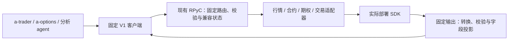

# 稳定桥接 API 与服务端兼容

状态：架构方向及 Q1–Q10 范围和行为选择已确认，设计讨论已收敛；已取得只读 RPC 样本并形成返回模型草案，2026-09-23。运行时及两个使用方已迁移至工作树版本 0.4.0.dev1，新增 SDK 通过同一 V1 下的策略注册与选择对接；实现和部署边界见[实现记录](contract-v1-implementation.md)。架构决策见 [ADR 0002](../adr/0002-stable-bridge-contract.md)，术语见 [CONTEXT.md](../../CONTEXT.md)，实测格式及剩余边界见[返回模型](../api/contract-v1-returns.md)。

## 已明确的要求

- 基于当前版本固化桥接 API 名称、输入参数和输出约定，使未来 SDK 或 qmt-rpyc 服务端升级的差异由服务端承担。
- 发现签名不一致不阻止服务启动；服务端输出警告，客户端调用受影响接口时返回错误。
- 以实际 Windows 券商部署为 SDK 事实来源。需要部署信息时，提供本机执行指令，不以旧 RPC 可连接为前提。
- 本轮先比较架构方向，再讨论实现细节；推荐方案不等同于已确认决策。
- Q1 已确认：采用固定桥接契约与服务端适配层。
- Q2 已确认：允许为了引入契约机制统一升级一次客户端。不要求新机制兼容未升级的旧客户端；具体迁移和版本协商规则尚待设计。
- Q3 已确认：以 a-trader、a-options 的实际依赖为优先，补充少量股票分析接口；不用全量导出。使用方必需接口必须保留并补齐适配，不能通过永久标记不可用来完成迁移。
- Q4 已确认：只返回契约约定字段。
- Q5 已确认：若导出回调接口，由桥接层统一管理。
- 用户追加：补入取消订单能力；当前纳入两个同步撤单接口。
- Q6 已确认：保留现有返回形态和字段名，逐接口固定字段、类型与空值规则。
- Q7 已确认：逐字段固定现有格式，SDK 变化由服务端适配；不要求所有时间字段统一单位。
- Q8 已确认：保留 `get_option_list` 的 SDK 现有日期含义，使用方继续按实际到期日筛选。
- Q9 已确认：下载任务成功表示 SDK 下载调用正常结束，不承诺所需数据完整可读。
- Q10 已确认：周线、月线不纳入首版。用户确认当前部署 SDK 不支持，需要使用方自行计算；桥接层不提供周/月聚合。首版 K 线周期范围为 `1m/5m/15m/30m/1h/1d`，不自动提供 `60m` 别名。

## 当前代码事实

- `src/qmt_rpyc/protocol.py` 已有传输协议版本和接口清单格式版本；它们没有定义逐个业务 API 的稳定输入输出。
- `server/api_surface.py` 从当前部署 SDK 发现名称、签名文本、文档、常量和类型名称；无法反射的签名记录为空字符串。
- `client.py` 根据服务端清单建立代理，`proxy.py` 将任意位置参数和关键字参数发送至服务端；元数据签名没有用于参数约束。
- `server/service.py` 以发现清单作为允许调用的名称集合；输入会被本地化，Trader 账户参数另有转换，下载另有任务封装。因此当前边界并非完全无转换的透明代理。
- `server/serializer.py` 提供通用序列化，但没有逐接口返回模型。SDK 对象属性、DataFrame 列或数据语义的变化可能传播到客户端，即使函数签名没有变化。
- 仓库的 `api_surface.example.json` 明确是 mock 示例。用户提供的实际 Windows 导出保存为 [qmt-api-baseline-20260923.json](../api/qmt-api-baseline-20260923.json)，其中 qmt-rpyc 包版本为 `0.3.1`；该文件是部署接口清单基线，尚不是完整的桥接输入输出契约。

## 已比较的架构候选

| 方案 | 内容 | 取舍 |
| --- | --- | --- |
| 接口快照与差异检查 | 保存接口清单，升级时比较，调用不匹配项时报错 | 适合作为迁移步骤；单独使用不能固化返回结构或吸收 SDK 差异 |
| 独立的桥接 API 契约与服务端适配层（已选） | 从选定接口的客户端行为建立 V1 契约，服务端将部署 SDK 转换成 V1 输入输出 | 保留现有使用方式；需要补全返回模型、语义及部署验证证据 |
| 重新设计业务 API | 定义一套新的行情、账户和交易领域接口，再适配 SDK | 长期接口可能更简洁；客户端迁移成本高，完整 SDK 能力覆盖需另行设计 |

已选方案的数据流是：客户端使用固定桥接契约，服务端校验输入并做适配，调用部署 SDK，再将结果转换和校验为固定返回结构。运行时发现用于兼容性诊断，不直接决定对外接口。固定契约与每个接口当前的可用状态分开保存；不可用接口保留名称并给出明确错误。

基于允许统一升级一次的约束，客户端随包携带固定契约，服务端按双方共同支持的契约提供接口。未来 SDK 变化不能修改客户端契约。由这一原则推导的版本与错误处理实现建议见下文，不将协议字段名称等工程细节另列为用户选择题。

## 基于使用方调查收敛的范围

2026-09-23 已只读检查 a-trader `2c40007`、a-options `7d0fad7`，详见[使用方依赖矩阵](../api/consumer-dependencies.md)。原使用方依赖共 14 个接口，另按用户要求加入 2 个撤单接口，加上建议补充的 6 个分析接口，共 22 个：16 个 xtdata、6 个 Trader。桥接自身的连接、健康、能力查询、batch 和下载任务管理不计入这个 SDK 接口数量。

| 范围 | API | 目的 |
| --- | --- | --- |
| 必需：行情与历史 | `get_full_tick`、`get_trading_dates`、`download_history_data`、`get_market_data_ex`、`get_divid_factors` | 行情、交易日、历史数据和除权除息事实 |
| 必需：标的资料 | `get_stock_list_in_sector`、`get_instrument_detail` | 股票/期权发现、资料和身份 |
| 必需：期权 | `get_option_undl_data`、`get_option_list`、`get_option_detail_data` | 期权链和合约读取 |
| 必需：账户与交易 | `query_stock_asset`、`query_stock_orders`、`query_stock_positions`、`order_stock` | 资产、委托、券商可卖量和下单 |
| 用户新增：撤单 | `cancel_order_stock`、`cancel_order_stock_sysid` | 按委托编号或市场/柜台合同编号撤单 |
| 补充：板块分析 | `get_sector_list`、`download_sector_data` | 枚举分析范围、准备板块数据；复用已有成分股查询 |
| 补充：财务分析 | `get_financial_data`、`download_financial_data` | 盈利、现金流和资产负债等基础数据 |
| 补充：指数分析 | `get_index_weight`、`download_index_weight` | 成分权重和指数比较的基础数据 |

全部 22 个名称都存在于本次 Windows 清单，但完整返回模型和行为仍需验证。下载是明确的数据准备能力，查询不自动补下载。先保障原 14 个依赖接口与 2 个撤单接口，分析补充项逐个验证，不用可选能力阻塞核心迁移。

保留 a-trader 现有启动要求的 10 个常量，并补充撤单的 SH_MARKET/SZ_MARKET 和完整委托状态所需的 ORDER_UNREPORTED/ORDER_WAIT_REPORTING/ORDER_REPORTED/ORDER_UNKNOWN，共 16 个。明确市场、买卖、报价和订单状态的对应语义。其余 SDK 名称不进入 V1；全量 SDK 导出仅用于诊断。这是统一的产品接口范围，不是新增 per-client 权限体系。

当前必需项及补充项均不需要客户端回调，因此 V1 不建设完整回调交付通道，也不导出通用 callable、原生对象工具、SDK 生命周期控制、未使用的异步查询或行情订阅。服务端内部连接回调仍用于运行管理；未来增加公开回调接口时遵守 Q5。

## 收敛后的实现建议



建议客户端继续提供 `client.xtdata.*`、`client.trader.*`，但只定义选定方法，不保留未知属性生成任意 RPC 的兜底。同一套 V1 定义供客户端和服务端使用，覆盖参数、默认值、输出模型、单位、空值和操作类别。22 个方法适合显式实现与少量共享校验，不需要建设面向完整 SDK 的通用插件平台，也不需要更换 RPyC。

公开 API 不必与同名 SDK 函数一一对应。a-trader 代码已记录期权函数的 `OptUndlUniCode=None` 故障，并使用板块列表与完整合约资料绕过；a-options 仍依赖原函数。建议验证后将适用的兼容逻辑集中到服务端，一个公开方法可以组合多个 SDK 调用。不能未经验证就把合约名称推断、默认期权乘数等启发式当成普遍规则。

后续取得的当前 SDK 定义没有该 OptUndlUniCode 路径，且完整资料保留嵌套 ExtendInfo；因此旧工作绕过方案不能直接照搬。本次源码能确认的映射差异及剩余证据见[源码审阅](../api/sdk-source-review.md)。

后续 RPC 实测已确认期权接口本次可用、详情缺少 InstrumentName、完整资料的 OptUndlCode 等位于 ExtendInfo。服务端补名称和明确嵌套字段映射有实际依据；一次迁移须对齐 a-trader 旧绕过路径，不能继续要求完整资料原生具有顶层 OptUndlCode。

兼容检查针对当前适配器实际依赖的 SDK 接口。经过验证的适配器可以支持不同底层签名；没有适用适配器或必需依赖不匹配时，警告并阻止受影响公开 API 的执行。同一个底层故障可能影响多个公开接口，应按依赖关系传播状态。忽略签名排版、绑定 self 等表示差异，不能只比较原始字符串。

固定契约还须描述参数分支。实测同一个 get_market_data_ex 在日线正常返回，周/月/60m 查询却返回 TypeError；周期允许集合、field_list 的列集合与返回格式必须显式定义。针对 60m/1w/1mon 的复查均得到 `'NoneType' object is not iterable`，该错误本身只证明当前接口路径不可用；用户随后在 Q10 明确补充当前 SDK 不支持周/月线，并将其排除在首版之外。不在契约允许集合内的请求应在调用前给出稳定参数错误；契约中已承诺但暂不兼容的分支则报告其不可用，不能关闭其他已验证的周期。

按 Q6 保留现有字典、列表、标量及按证券组织的 split 表形态和字段名，并为每类数据规定字段和类型；股票与期权资料可使用按品种区分的模型。`field_list=[]` 表示 V1 约定字段全集，不是 SDK 最新列全集。固定结构缺失必需字段或无法确认类型/单位时明确报错；证券代码、日期、财务表名等动态键按类型化映射保留。

校验必须区分合法空数据、nullable 值与缺失必需字段。实测有 OHLC 为 null 的 K 线、有列名但无行的 K 线表，以及列名/索引/数据均为空的财务表；这些结构不得自动判为 SDK 不兼容。非空表缺必需列、行宽错误或字段类型不符才按相应契约报错。具体规则见[返回模型草案](../api/contract-v1-returns.md)。

两个使用方消费的字段并集是最低需求，不是股票分析字段的上限。行情的开高低、前收盘、成交额，以及资料中的上市日、涨跌停价、股本、交易状态可作为分析字段候选，需实际 SDK 定义/样本支持。SDK 新增普通字段不会自动透出。

桥接层提供稳定、可解释的基础事实；策略指标、复权计算、估值和交易决策继续属于使用方。不借此次迁移悄悄改变数值结果，尤其不能未经证据统一成交量单位或混淆单次与累计复权因子。

## 撤单契约

| 桥接方法 | 输入 |
| --- | --- |
| `cancel_order_stock(account, order_id)` | 账户 ID 字符串、同步下单返回的委托编号 |
| `cancel_order_stock_sysid(account, market, sysid)` | 账户 ID 字符串、市场常量、柜台合同编号 |

市场常量固定为本次基线的 `SH_MARKET=0`、`SZ_MARKET=1`，适配器负责未来底层值变化。委托编号与柜台合同编号不能互换；柜台编号按不透明标识处理，不能为了校验随意转成整数。

当前部署文档声明第一种返回 0/-1/-2/-3，分别表示成功/委托已完成/未找到委托/未登录；第二种返回 0/-1。更新后的源码已经确认两种实现都返回 `resp.cancel_result`。建议保留整数结果并形成明确枚举说明；原生响应各码的产生条件不在 Python 实现中，不能把 docstring 当作完整行为证明。

补充委托输出中的 order_sysid、status_msg 及账户/交易方向等核对字段。可先调用 `query_stock_orders(account, cancelable_only=True)` 取得候选，再用已有委托查询确认撤单后的状态和实际成交数量，不必增加单笔查询 API。SDK 报告本次撤单调用成功不等于该委托从未成交，部分成交量必须保留。

签名不匹配时按原要求警告、正常启动、调用前拒绝该接口。执行前拒绝与进入 SDK 后结果不确定分开表达；超时或响应无法确认时不自动重发。同步撤单不需要公开客户端回调，两个异步变体暂不导出。验证使用 mock 和定义审查，不为采集证据执行真实撤单。

同步 Trader helper 实际通过 SDK 内部回调完成 Future，并调用没有 timeout 的 `future.result()`；客户端 RPC 超时不会自动终止该等待，也不能证明请求未执行。该原生等待问题与签名不兼容不同，不承诺通过本次契约校验自动恢复。

## 后续必须覆盖的边界

- 固化所选接口的参数顺序、名称、种类、默认值、类型、返回字段和嵌套结构，以及常量、时间/金额等单位、空值和下载任务。所选接口不得以出参 Any 或未受约束的透传逃避契约；不在范围内的名称明确不导出。
- 新契约如何与现有传输和清单版本共同演进。已允许统一升级一次，业务契约版本不能简单等同于 SDK 或包版本。
- 签名比较需按结构进行，区分 SDK 漂移与已经验证可转换的适配器。无法反射、仅有泛化签名或缺少返回结构证据时，不得声称已验证兼容。
- 默认值的变化也可能影响未传参数的旧调用。常量值变化需要按接口语义映射，不能对所有整数全局替换。
- 无法兼容的接口在调用 SDK 前拒绝；批量、下载和事件路径也必须受同一契约约束。保留现有批量并发决策，不引入进程级 xtdata 串行化。
- 返回结构变化可能只能在调用后发现。若交易操作已经进入 SDK，返回转换失败不能被描述为“交易未执行”，不能自动重试；此类错误与调用前拒绝须区分。
- 签名相同不能证明业务语义相同。返回约定需要部署样本、SDK 可读定义和针对性行为验证；事件与回调的远程兼容性须单独验证。
- API 不兼容导致的局部不可用与 QMT 连接状态分别报告，不能因单个接口漂移否定整个服务的健康。SDK 无法导入、原生阻塞或进程崩溃不属于签名比较能够解决的问题。

## 实现规则收敛

以下是依据已确认目标给出的实现建议；完整字段枚举与校验代码尚未实现。它们不新增 API 范围、不更改返回形态，也不要求再逐项选择实现工具。

### 固定定义与版本

- 同一份受版本控制的定义供两端使用，覆盖名称、参数、默认值、参数允许集合、字段模型、常量和错误约定。适配器是显式服务端代码，运行时反射仅诊断 SDK，不增删客户端方法。
- 包版本、传输协议版本和业务契约版本分别管理。初次引入契约可以利用已允许的一次协调升级；以后仅更换 SDK 或调整服务端适配器，不因包版本不同要求已有使用方升级。
- 每份已发布契约快照保持不变。握手选取双方支持的快照；响应字段按该快照投影。新增接口或字段以新的兼容快照提供，旧快照继续服务；要使用新能力的客户端可以升级，已有调用不被迫跟随。
- 只有缺少共同契约或传输本身不兼容才拒绝建立业务会话。单个接口/参数分支不兼容通过能力状态报告；固定方法仍存在，调用返回明确错误。包版本或整份 SDK 指纹不同本身不是拒绝所有接口的条件。
- `_surface` 不再作为使用方自行判断契约的私有入口；提供公开的契约信息和能力状态。a-trader 按所需交易/行情能力决定可执行的功能，qmt-rpyc 不因局部故障全局拒绝连接。

### 调用前后校验与错误边界

| 情形 | 行为 |
| --- | --- |
| SDK 缺少依赖或签名与选定适配器不匹配 | 启动时警告并记录受影响能力；不调用 SDK，客户端请求时收到兼容性错误 |
| 名称或参数不在契约范围 | 调用前返回稳定的接口/参数错误；不尝试任意透传 |
| SDK 正常返回新增非契约字段 | 过滤掉；不改变旧快照的响应 |
| 合法空表、已约定 nullable 值或日期占位 | 按契约返回，不补 0，不当作签名漂移 |
| 非空结果缺必需字段、类型错误或未知编码 | 本次调用返回响应契约错误，并记录字段路径；不把坏结果转为空成功，也不因一个样本自动永久关闭整接口 |
| 下单/撤单已进入 SDK 后超时或响应无法验证 | 返回执行结果不确定，不能描述为未执行，不自动重试；沿用消费方的查询核对流程 |

错误需携带稳定类别、API、契约版本及发生阶段；可读说明供排查，消费方不靠匹配 SDK 异常字符串决定是否重试。普通多证券查询中遇到未约定的结构错误，整次请求报错，避免静默丢弃坏记录；已有 `.batch` 则保持逐调用结果隔离及原顺序。合法缺行情/空数据另按各接口模型处理。

启动检查只检查定义和适配依赖，不为验证兼容性自动执行下载、下单或撤单，也不以账户查询成功作为 RPC 启动条件。已采样的响应作为回归素材，结合模拟 SDK 的签名、默认值、常量和返回漂移检验兼容边界。

### 实施顺序及待验证事实

目标范围继续是 22 个接口与 16 个常量，不因部分字段尚需验证而默默删减分析接口。先完成共用契约机制与原 14 个依赖接口、两个撤单接口，再完成六个分析补充接口；核心与补充能力分别验证，不用补充能力的运行时不可用阻断核心调用。

一次迁移必须覆盖两个使用方的安装约束、能力检查、下载等待、分红 split 解析、期权字段映射和错误传播；不只更新 qmt-rpyc 包。交易用 mock 验证调用及不确定结果处理，不通过真实下单/撤单采样。

复权因子、跨品种数量单位、财务字段含义、Trader 返回类型等尚缺的证据属于工程验证，不要求用户猜测数值含义。未知语义不通过重命名、默认值或数值换算掩盖；发布契约前记录可支持的范围及验证证据。

## 第四轮结果：首版 K 线周期范围（Q10）

用户已确认周线、月线不纳入首版，并说明当前部署 SDK 不支持，需要自行计算。周/月聚合属于使用方的数据计算；本次不在 qmt-rpyc 中建设该能力，也不修改使用方增加聚合功能。它不再是桥接契约发布前的调查或适配待办。

首版 K 线周期范围固定为 `1m/5m/15m/30m/1h/1d` 六类，不将 `60m` 自动当成 `1h`。历史 K 线查询与对应下载路径均按契约的周期范围校验；`1w/1wk/1mon/60m` 等范围外参数调用前明确报错，不再尝试透传。此范围只描述 K 线，不将它误用为财务表名或其他接口的参数约束。

日线和 1m 已有非空返回证据；其余四类目前只观察到正常空表，仍需补齐非空格式及对应下载路径验证，不能标成已验证完成。a-trader 研究 HTTP API 目前可以下传任意 period 字符串，一次迁移时须与这个固定范围对齐，不能依赖运行时 SDK 报错来定义允许值。

Q1–Q10 的设计选择至此已收敛。后续工作是固化接口定义、实现两端契约和服务端适配、迁移两个使用方并完成验证；工程验证中的未知项不等同于需要继续由用户选择的架构问题。

## 实际部署基线

用户提供的 [qmt-api-baseline-20260923.json](../api/qmt-api-baseline-20260923.json) 导出于 `2026-09-23T17:22:07.620191+00:00`，运行环境为 Windows、Python `3.11.9`、qmt-rpyc `0.3.1`，传输协议和清单格式版本均为 `1`。文件 SHA-256 为 `0d1fac73669e0e7584cc3953083752e841e665c41418528c54d72aaec067bdfe`。按用户要求使用日期化基线名称，内容保持不变，后续契约和审核记录另行维护。该文件保留全量部署接口和常量，便于审计选定范围与将来的 SDK 差异；它与只覆盖选定接口实现的源码采集用途不同。

| 项目 | 数量 | 已知限制 |
| --- | ---: | --- |
| xtdata 函数 | 69 | 28 个无文档 |
| Trader 方法 | 51 | 11 个无文档 |
| 常量 | 90 | 有名称和值，未提供完整语义关系 |
| xttype 类型 | 13 | 只有名称，没有属性和字段模型 |

120 个可调用名称都有非空签名文本，但 `xtdata.getDividFactors` 和 `xtdata.timetagToDateTime` 只有 `(*args, **kwargs)`。其余 118 个签名能描述参数绑定方式，仍不能证明输入类型、返回结构或远程可用性。

69 个条目包含返回说明标记，但说明经常只给笼统结果或容器描述。`query_stock_asset` 只说明返回资产数据，没有列出类型和字段；`get_full_tick` 只说明嵌套字典，未给出完整字段模型。不能据此自动生成已经验证的返回契约。

文档本身也需要核对：`get_market_data_ex` 和 `get_market_data` 的 docstring 完全相同，不能因此认定实际返回结构相同；`download_history_data2` 的参数签名是 `stock_list`，文档却写 `stock_code`。参数绑定以反射结果为证据，业务语义和返回模型仍需进一步核实。

全量清单中曾识别到的边界如下；范围收敛后，不应为未选中的名称建设兼容设施：

- `xtdata.create_array(shape, dtype_tuple, capsule, size)`、`get_client()`：参数或名称提示涉及本地对象，文档为空；远程适用性尚未验证，不能仅凭发现就认定可提供稳定数据契约。
- `subscribe_quote(..., callback=None)`、`query_stock_asset_async(self, account, callback)` 等回调接口：共有 22 个签名含 `callback`（xtdata 6、Trader 16），客户端回调如何跨机器交付需要显式契约。另有不带显式回调参数、直接返回请求序号的异步下单或撤单接口，不能按 `_async` 后缀统一推断行为。
- `common_op_async_with_seq(self, seq, callable, callback)`、`common_op_sync_with_seq(self, seq, callable)`：接受任意 callable，不能直接套用普通数据参数模型。
- `register_callback`、`start`、`stop`、`connect` 等 Trader 控制接口：没有发现使用方直接依赖，不纳入当前 V1。服务端仍管理共享 Trader 的生命周期，这不引入新的权限体系。

导出没有记录 SDK 版本或构建指纹，也没有实际响应、类型字段定义或事件样本。下一步采集应定向补足这些信息，不通过遍历调用全部 API 来获得返回样本。SDK 的本机导入和反射仍不依赖 RPC；部署 SDK 的导入副作用需与显式业务调用区分。

用户更新后的 [contract-v1-sources.json](../api/contract-v1-sources.json) 已包含全部选定的 22 个接口、7 个类型、4 个内部 helper、16 个常量和四个模块文件指纹，没有检查失败。所选签名与常量均和原始部署基线一致。源码已证实资产/委托/持仓字段、同步下单返回 order_id、撤单返回 cancel_result、分红返回 DataFrame，以及常用 K 线按证券返回 DataFrame 等事实；仍不能替代原生响应的类型、单位和业务行为验证。详见[源码审阅](../api/sdk-source-review.md)。

尤其是四个下载函数均没有 return；任务 completed 只能表达 SDK 调用正常返回，不能用返回值真假判定下载成功，也不能因此保证请求范围的数据完整可读。a-options 需要等待任务返回后再读取并验证所需数据。

## 一次迁移与验证

迁移应覆盖 qmt-rpyc 两端及两个使用方的 QMT 适配边界和安装版本约束。只升级 pip 包不足以兑现兼容保证。具体证据见[使用方调查](../api/consumer-dependencies.md#一次迁移必须处理的问题)：

- 两仓库的 requirements 与启动安装器均锁定 `0.3.1rc1`，要同步更新，避免新库被装回旧版。
- a-trader 使用私有 `_surface` 做启动检查，需要迁移到公开的契约/能力查询；它的账户和交易日探测也要区分 RPC 可连接与应用必需能力是否满足。
- a-options 下载后立即读历史，必须明确等待任务完成；其分红因子解析不接受 split 表，且对累计/逐次因子存在语义分歧，需要真实证据后修正。
- a-options 的异常转空集合、未知 optType 当 PUT，以及 a-trader 的资产缺字段填 0，不能掩盖契约错误。保持合法空数据与接口失败可区分。
- 下单执行前拒绝与执行结果不确定分别报告；沿用 a-trader 的不重试和不确定订单处理，不能把响应校验失败变成 None/-1。
- 时间适配必须验证委托对账与交易日读取：a-trader 的 `order_time` 按 Unix 秒解释，交易日列表按 Unix 毫秒解释；a-options 的日线逻辑按日期字符串前八位处理。不可直接全局替换为一种单位。

建议先定义并验证原 14 个依赖接口、2 个撤单接口、16 个常量和桥接辅助能力，再逐项加入 6 个分析接口。针对 SDK 改参数/默认值/常量、缺字段、返回异常做 mock 回归，验证仍可启动且错误只影响相关接口。联合消费方验证下载等待、时间和数值、期权资料、除权除息解析与下单/撤单不确定结果；使用合成账户数据和 mock 交易，不通过真实下单或撤单采集返回值。最后进行 Windows SDK 读取和返回结构验证。

## 第三轮结果：对外行为（Q6–Q9）

Q6–Q9 均已确认。保留现有返回容器与字段名；时间逐字段固定现有格式，SDK 变化由服务端适配；`get_option_list` 的 `dedate` 继续沿用当前 SDK 含义，参数名及 `isavailavle` 的现有拼写也不借此修改；下载任务 `completed` 仅表示 SDK 调用正常结束。Q8 固定的是当前基线语义，未来 SDK 若改变该含义，仍由适配器维持 V1，而不是跟随新 SDK 改动。

Q7 最初以可行性为前提，在补查消费方并说明方案后，用户明确选择逐字段固定现有格式。Q6 保留容器和字段名不妨碍固定返回模型：例如同为字典，可以明确其哪些键是证券代码、每个证券对象有哪些字段、每个字段是什么类型。split 表同样可以约定列名、列类型、索引含义和空表规则；不需要改成新的记录对象才能校验。

### 时间输出方案（Q7 已确认）

先定义每个接口的返回模型，再为确定的字段路径绑定转换规则：输入编码、目标编码、单位、时区、空值和有效范围。SDK 返回先经该接口适配器转换与字段投影，再校验输出，最后按现有形态传输。通用序列化器只负责可传输的表示，不负责猜测业务含义。

新补查证据表明，全部时点改为毫秒虽然可以通过一次消费方迁移实现，但影响委托身份核验等路径。为优先保障现有使用方，用户选择 V1 固定各字段当前可验证的格式，未来 SDK 差异转换到该格式；不要求所有时间字段都使用同一种单位。

| 字段路径/位置 | 当前已查明的消费约束 | 建议的 V1 边界 |
| --- | --- | --- |
| `query_stock_orders()[i].order_time` | a-trader 对账直接按 Unix 秒取上海日期，人工终态证据也声明秒 | 固定秒整数；不能直接改毫秒，否则可能阻断对账。原生返回单位仍须部署证据核对 |
| `get_trading_dates()[i]` | a-trader 除以 1000 后取 UTC+8 日期；RPC 样本对应交易日上海零点 | 固定毫秒整数列表 |
| `get_full_tick()[code].time` | RPC 样本为 Unix 毫秒整数，与 timetag 对应 | 固定毫秒整数，仅按明确路径转换 |
| `get_market_data_ex()[code].index` 与 `time` 列 | 默认日线 index 为八位整数、1m index 为十四位整数；日线显式 time 列却是毫秒整数 | 分别固定各字段格式，不能将同一表的 index 与 time 列统一转换；其他周期非空值需验证 |
| `ExpireDate/OpenDate/CreateDate` 等日期字段 | 有八位字符串，也观察到完整资料中的 `0`、`99999999` 字符串占位 | 固定现有字符串及明确占位分支，不强制全部为合法日历日期 |
| 财务日期、除权除息时间 | 财务日期为八位字符串；分红 index 为八位字符串，time 列为浮点形式的毫秒 | 保留各自编码；字段含义和单位不扩大成未经验证的语义保证 |

例如，若某适配器已验证新版 SDK 的 `order_time` 是毫秒，可以转换回 V1 约定的秒；精度损失规则需明确，不能悄悄截断。同一字段遇到未知编码时应报返回契约错误，不能靠数值位数或机器默认时区猜测，也不能原样透传未知新格式。公开字段的缺省、None、0 和非法值分开约定。

尚无证据的字段先不做单位转换；收集证据后才能完成并冻结其 V1 规则。这不允许必需接口长期以 Any 或动态透传交付。升级后新增的非契约字段过滤掉，必需字段缺失、类型或编码不匹配则明确报错；返回错误通常只能在调用后发现，不等同于启动时签名错误。

本轮结果不改变签名不匹配时警告、正常启动、受影响接口调用报错的要求。业务契约版本格式、错误字段等实现细节待返回模型与证据稳定后整理。

## 已取得的返回证据与后续验证

所需公开接口、相关类型和已列出的内部 helper 定义均已取得，无需重复导出。用户提交的本机采集仅保存了导入前记录；在用户要求更新本地客户端后，已通过 0.3.1 客户端取得 21 次成功的只读调用，以及 11 次 K 线参数补采（7 次正常返回、4 次 TypeError）。已有样本足以明确常用返回容器、列名、时间格式及部分空值分支；详见[返回模型及证据](../api/contract-v1-returns.md)。不再要求用户重跑相同的大范围采集。

分红因子和成交量语义未明确前，不把使用方的猜测当作事实，也不要求用户先猜测实现选项。部署调查仍从本机反射和定向只读采样开始，不依赖旧 RPC 先恢复。

[返回样本采集脚本](../../scripts/dump_contract_samples.py)保留给后续需要原生类型证据或 RPC 不可用时使用，本轮暂不需要重跑。已修正为与服务一致的 pandas/numpy→时间戳补丁→SDK 导入顺序，逐模块保存进度，并记录可捕获的 SystemExit/KeyboardInterrupt；这消除了诊断缺口，不代表已经定位原进程退出原因。在实际服务使用的 Windows Python 环境执行，也可仅复制脚本到已安装服务包的机器运行。命令默认采三只公开证券、最近两年的查询范围、每个表最多三行；K 线额外通过 count 限制为三条。文件名已存在时拒绝覆盖。

```bat
python scripts\dump_contract_samples.py --output contract-v1-samples-next.json --show-sdk-output
```

脚本读取 tick、交易日、日线/分钟线、除权除息、完整合约资料、板块名、八类财务表、指数权重；从当月 510050.SH 的期权列表选至多一只合约补充详情和 tick。记录原始类型、表的全部列及 dtype、有限值样本和截断标识、本机时区、模块指纹及每次调用的参数/结果状态。为了与现有服务执行环境一致，先加载已安装服务包的时间戳兼容补丁并记录版本、状态和文件指纹；不在采集脚本中实现新的业务时间转换。

该工具不构造 Trader、不读取账户或认证配置、不发起下载、下单、撤单或订阅；SDK 查询仍可能连接 MiniQMT 并读取远端数据。SDK 日志及可能包含私人路径的异常原文不写入证据；--show-sdk-output 仅在终端保留 SDK 诊断。调用前后保存当前结果，某项普通异常仍继续其余项；原生阻塞/退出时只保证保留此前已写出的结果和正在执行的标签，不提供 SDK 超时或恢复能力。`collection_status=completed` 仅表示采集流程结束，各调用的 error、空数据和 sampling_error 必须分别检查。

这轮样本不包含资产、委托或持仓账户数据，也不能单凭几个样本证明金额/数量/复权等全部语义。需先核对原始样本，再决定是否存在有针对性的剩余证据缺口；不要求用户重复采集已确认的源码。

保留[定向定义采集脚本](../../scripts/dump_contract_sources.py)供未来 SDK 更新后复查，本轮不需要再运行。后续复查时，在实际服务使用的 Windows Python 环境、仓库根目录运行，并选择新的输出文件名：

```bat
python scripts\dump_contract_sources.py --output contract-v1-sources-next.json
```

更新后的脚本提供增量模式，只补采两个撤单方法、三个类型和四个内部 helper，另记录新增常量与模块指纹；内部 helper 不进入公开契约。省略 --supplement 可采全部选定的 22 个公开接口、7 个类型和内部依赖。脚本不构造 Trader、不执行查询/下载/交易，也不读取账户或认证配置。导入 SDK 自身的副作用仍取决于实际部署。无法读取的定义明确记录为缺失，采集输出不能代替真实响应验证。只安装了 Python 包的机器可复制该脚本单独运行，无需先启动 RPC。
